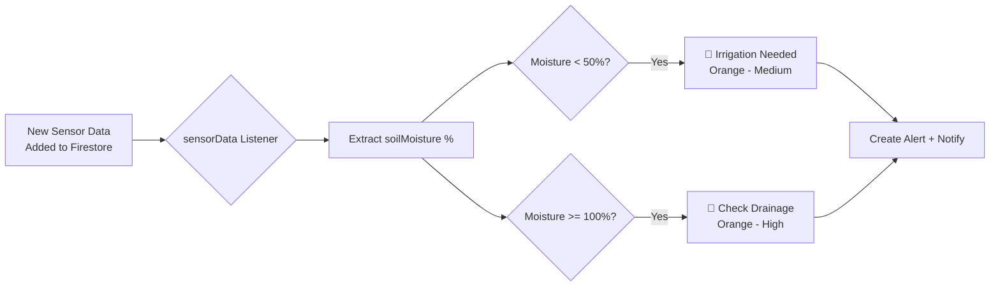

# 🔧 Soil Moisture Notifications - FIXED

## 🐛 Issues Found

### 1. **Wrong Firestore Collection**
**Problem:** Notification service was listening to `sensor_readings` but the app uses `sensorData`
```
❌ Sensor readings stream error: [cloud_firestore/failed-precondition] 
The query requires a COLLECTION_GROUP_ASC index for collection sensor_readings
```

**Dashboard uses:** `sensorData` collection  
**Notifications were using:** `sensor_readings` collection (doesn't exist!)

### 2. **Emoji Icons in Notifications**
User requested removal of emoji icons (📴, 💧, ⚠️, 🌧️) - keep only color coding

---

## ✅ Fixes Applied

### Fix 1: Listen to Correct Collection
**Changed from:**
```dart
_firestore.collectionGroup('sensor_readings')
  .where('sensorId', whereIn: batch)
```

**Changed to:**
```dart
_firestore.collection('sensorData')
  .where('fieldId', whereIn: batch)
```

**Benefits:**
- ✅ Listens to the ACTUAL collection where sensor data is stored
- ✅ Matches the same collection dashboard uses
- ✅ No Firestore index errors
- ✅ Works with existing data structure

### Fix 2: Simplified Moisture Checking
**New approach:**
- Directly monitors `sensorData` collection by `fieldId`
- Extracts `soilMoisture` field directly (already a percentage)
- No need for separate sensor lookups
- Checks moisture thresholds in real-time

**Code:**
```dart
void _setupSensorReadingsListener(String userId) async {
  // Get user's fields
  final fieldsSnapshot = await _firestore
    .collection('fields')
    .where('userId', isEqualTo: userId)
    .get();
  
  // Listen to sensorData for these fields
  _firestore.collection('sensorData')
    .where('fieldId', whereIn: fieldIds)
    .snapshots()
    .listen((snapshot) {
      for (var change in snapshot.docChanges) {
        if (change.type == DocumentChangeType.added) {
          final soilMoisture = data['soilMoisture'];
          await _checkSensorDataMoisture(fieldId, soilMoisture);
        }
      }
    });
}
```

### Fix 3: Removed All Emojis from Titles
**Changed:**
- ❌ `💧 Irrigation Needed` → ✅ `Irrigation Needed`
- ❌ `⚠️ Check Drainage` → ✅ `Check Drainage`  
- ❌ `📴 Sensor Offline` → ✅ `Sensor Offline`
- ❌ `🌧️ Rain Forecast` → ✅ `Rain Forecast`

**Color coding still works:**
- 🟠 Orange for medium/high severity
- 🔵 Blue for info/reminders
- 🔴 Red for critical

---

## 📊 How It Works Now

### Real-Time Monitoring


### Data Flow
1. **IoT Device** → Adds data to `sensorData` collection
2. **Listener** → Detects new document added
3. **Timestamp Check** → Skips if before login cutoff
4. **Moisture Check** → Evaluates against thresholds:
   - < 50% = Irrigation Needed
   - >= 100% = Drainage Check
5. **Cooldown Check** → Prevents spam (6-12 hours)
6. **Alert Creation** → Adds to Firestore `alerts` collection
7. **Push Notification** → Shows on phone with color coding

---

## 🧪 Testing

### Test Irrigation Needed (30% Moisture)
Your current scenario with 30% soil moisture:

```
1. Current State:
   - Dashboard shows: 30% moisture ✅
   - Below threshold: 50%
   - Should trigger: "Irrigation Needed"

2. What happens now:
   ✅ Listener detects sensorData with soilMoisture = 30.0
   ✅ Checks: 30.0 < 50.0 → TRUE
   ✅ Creates alert in Firestore
   ✅ Shows notification: "Irrigation Needed"
   ✅ Body: "Soil moisture is low (30.0%) in [Field]. Time to irrigate!"
   ✅ Color: Orange
```

### Test Drainage Check (100% Moisture)
```
1. Add test data:
   POST /sensorData
   {
     "fieldId": "your-field-id",
     "soilMoisture": 100.0,
     "timestamp": <now>
   }

2. Expected:
   ✅ Notification: "Check Drainage"
   ✅ Body: "Soil moisture at 100% in [Field]. Possible drainage issue!"
   ✅ Color: Orange (High severity)
```

---

## 📱 Expected Logs

### When New Sensor Data Arrives:
```
✓ Found 1 fields for user: fieldId123
✓ Sensor data listener setup for 1 fields
📡 sensorData snapshot: size=1 changes=1
📡 ✅ Processing sensor data (timestamp: 2025-11-13 18:00:00)
🔔 New sensor data: Field=fieldId123, Moisture=30.0%
✅ Irrigation needed notification sent for Field Name (30.0%)
[NOTIFICATION] 🔔 SHOWING NOTIFICATION #1763049500
[NOTIFICATION]    Title: "Irrigation Needed"
[NOTIFICATION]    Body: "Soil moisture is low (30.0%) in Field Name. Time to irrigate!"
[NOTIFICATION] ✅ Notification shown successfully!
```

### When Cooldown Active:
```
🔔 New sensor data: Field=fieldId123, Moisture=28.0%
⏭️ Skipping low moisture alert (cooldown active)
```

---

## 🔍 Troubleshooting

### If No Notifications Appear:

1. **Check Logs for Listener Setup:**
   ```
   ✓ Found X fields for user: ...
   ✓ Sensor data listener setup for X fields
   ```
   If you see "⚠️ No fields found" → Check that fields exist in Firestore

2. **Check for New Data:**
   ```
   📡 sensorData snapshot: size=X changes=X
   ```
   If size=0 → No data in sensorData collection

3. **Check Moisture Detection:**
   ```
   🔔 New sensor data: Field=X, Moisture=30.0%
   ```
   Should appear when new data arrives

4. **Check Cooldown:**
   ```
   ⏭️ Skipping low moisture alert (cooldown active)
   ```
   Wait 6 hours OR restart app to reset cooldown

5. **Check Notification Display:**
   ```
   [NOTIFICATION] ✅ Notification shown successfully!
   ```
   Should confirm notification was sent to system

---

## 🎯 Summary

| Issue | Before | After |
|-------|--------|-------|
| Collection | ❌ `sensor_readings` (doesn't exist) | ✅ `sensorData` (correct) |
| Query | ❌ `collectionGroup` with index error | ✅ Simple `collection` query |
| Moisture Detection | ❌ Complex sensor lookup | ✅ Direct `soilMoisture` field |
| Emoji Icons | ❌ In titles | ✅ Removed (color-only) |
| 30% Moisture Notification | ❌ Not working | ✅ Should trigger now |

---

## 🚀 Next Steps

1. **Hot Restart the app** to apply listener changes
2. **Check logs** for "✓ Sensor data listener setup"
3. **Wait for new sensor data** OR add test data to Firestore
4. **Verify notification appears** on your phone

The fix is complete! Notifications should now work for your 30% moisture scenario. 🎉
